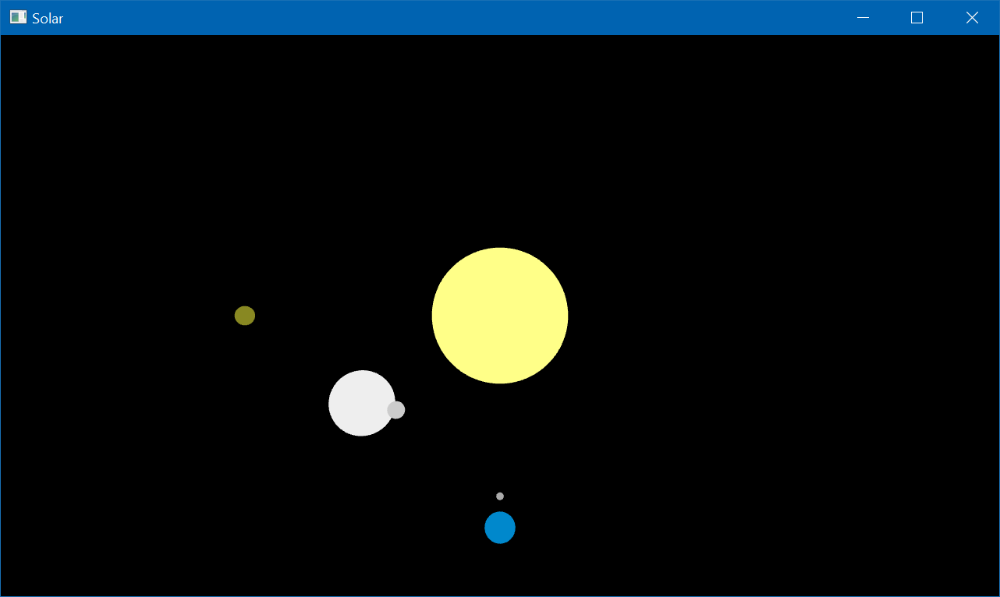

# Computer Graphic Assignment 4

Name: YU Jincheng ID: 3150101155
| Course: | >| > | Computer Graphics |
|--:|:--|--:|:--|
|Name:| <u>YU Jincheng</u>| ID:| <u>3150101155</u> |
|Major:| <u>Computer Science nd Technology</u>|
|Address:| <u>West Cao Building</u>| Teacher: | <u>Wu Hongzhi</u>|


## Experiment Purpose

- Knowing view and projection.
- Knowing how to change the view and look at vector
- Knowing how to implement navigation in openGL.

## Experiment Task

Build a solar system with OpenGL
- One sun, 2+ planets, 1+ satellite
- Planets orbit around the sun
- Satellites orbit around its planet
- Trajectories are not co-planar
- Navigation in the system (3D viewing)
    - E.g., W+S+A+D -> walk, mouse-move -> change view direction

## Basic principles

1. Position of objects
    I use vertex shader to implement position changing. Here is the key code of my vertex shader:

    ```GLSL
    mat4 ModelMatrix = TranslationMatrix * RotationMatrix * ScaleMatrix;
	gl_Position =  ProjectionMatrix * ViewMatrix * ModelMatrix  * vec4(vertex, 1);
    ```

    `ModelMatrix` is the world position of a object, generated by multiplying translation matrix and rotation matrix and scale matrix.
    And the view position is generated by multiplying projection matrix and view matrix and model matrix.

    In my implementation, the projection matrix is generated by `glm::perspective`. And the view matrix is generated by `glm::lookAt`.

2. Navigation
    The navigation of the "solar system" is changing the position of the camera and the direction it looks at.

    Using a vector $\vec{p} = [x, y, z]$ to determine the position of camera, we can then define two angles to define the direction of the camera (suppose the right vector of the camera always parallels to the $xOz$ plane because we don't tilt). $v$ is the vertical angle of the camera, and $h$ is the horizontal angle of the camera. then the direction of the camera can be defined as $\vec{d} = [\cos{v}\sin{h}, \sin{v}, \cos{v}\cos{h}]$.

    The right vector of the camera can be easily defined because of it perpendiculars to the direction vector and parallels to the $xOz$ plane. Then the right vector is $\vec{r}=[-\cos{h}, 0, \sin{h}]$.

    The up vector can be defined more easily because it's the cross multiplication of $\vec{d}$ and $\vec{r}$: $\vec{v} = \vec{r} \times \vec{d}$

    - Walking
        walking only change the position of the camera. Suppose the different of the position is $\vec{\mathrm{d}d}$, then the new position is $\vec{d^{\prime}} = \vec{d} + {\vec{\mathrm{d}d}}$.
    - Rotation
        Rotation is easy to implement by increasing or decreasing $v$ and $h$.

3. Drawing Sphere
    I did not use any existing function to draw a sphere but implement my own one. I draw a sphere by spherical coordinates. A specific point in spherical coordinates is described as $A=[\rho, \varphi, \theta]$, which can be converted to the  rectangular coordinates as $A=[\rho\cos\theta\cos\varphi, \rho\sin\theta\cos\varphi, \rho\sin\varphi]$.
    To draw the sphere, we need some triangles. I chose rectangle a on the surface and divided it into two triangles. The diagonal is the common line of these two triangles.
    Also I calculate the normals of these vertexes but I did not use it for lights and shadows. And the texture is a $1 \times 1$ pixel, and the uv coordinates of these vertexes are always $[0,0]$.

2. Rotation of the sphere
    It's very easy to determine the coordinates of a plane. Suppose its rotation angle is $\theta$, then its position can be $\vec{p}=[\sin{\theta},cos{\theta},0] \cdot r$, or $\vec{p}=[\sin{\theta},0,cos{\theta}] \cdot r$, anyway you define.
    If a satellite orbits around a planet, support the position of the planet is $\vec{q}$, then the final position of the satellite is $\vec{p^\prime}=\vec{p}+\vec{q}$.

## Experiment Result

Here is the screenshot of my assignment:


### Control instructions:
1. Hold the left button on your mouse on the windows, move the mouse, you can rotate your view.
2. Scroll can zoom in and zoom out.
3. Moving:
    - `w`: move forward
    - `s`：move backward
    - `a`: move leftward
    - `d`: move rightward
    - `space`: move upward
    - `shift+space`: move downward

## Discussion
This experiment is very interesting because it's like you are making your own FPS games!
I implemented it using `C++` and made my own framework so that I can extend my design on the next assignments or project.
I am also interesting to implement so other fancy functions such as: light and shadow, tilt the camera, rotate by the target object, realistic texture.

## Know issue
My laptop is using GLSL version 4.40 and the texture function is `texture`, however, in version 3.30, the texture function is `texture2d`. And they are NOT complicated! So on some machine, if the program is not working, then chang `texture` to `texture2d` of the file `fragmentShader` would help! I don't know how to deal with it so that my fragment shader can work on any computer after I googled for a long time.

## Reference
1. opengl-tutorial (www.opengl-tutorial.org).
    I learnt many things from the website, including how to compile my own shaders, how to use `glm`, `glfw` and `glew` libraries, why normals are useful and so on. All my codes referenced from this site are well comprehended by me and re-written in my own style.
2. An example to draw a sphere with vao and vbo (https://gist.github.com/zwzmzd/0195733fa1210346b00d)
    I referenced to this code and know how to draw a sphere with vao and vbo. But unfortunately, his code cannot work well. So I implemented it in my own way. But his code inspired me a lot!