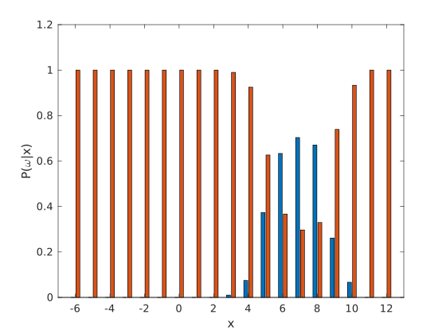

# Assignment #1

## 1. Machine Learning Problems
- (a)
    1. BF
    1. C
    1. AD
    1. BG
    1. AE
    1. AD
    1. BF
    1. AE
    1. BG
- (b)
    No. Data set should be divided into training set and test data. And we should not maximize the performance of the training set, but that of the test set.

## 2. Bayes Decision Rule
- (a)
    - (i)
        $$
        P(B_1=1)=\frac{1}{3}
        $$
    - (ii)
        $$
        P(B_2=0\mid B_1=1)=1
        $$
    - (iii)
        $$
        P(B_1=1\mid B_2=0)=\frac{P(B_2=0\mid B_1=1)+P(B_2=1\mid B_1=1)}{P(B_1=1)}=\frac{1}{2}
        $$
    - (iv)
        $$
        P(B_3=1\mid B_2=0)=P(B_1=1\mid B_2=0)=\frac{1}{2}
        $$
        So, after knowing B~2~ contains nothing, the probability of B~1~ and B~2~ containing the bonus is the same. So changing my choice or not are both okay.
- (b)
    - (i)
        The distribution of $P(x\mid \omega_i)$ is shown as follow:
        
        And the test error is 64.
    - (ii)
        The distribution of $P(\omega_i \mid x)$ is shown as follow:

        
        And the test error is 47.

    - (iii)
        The minimal total risk ($R=\sum_x\min_iR(\alpha_i \mid x)$) is $2.444354$.

## 3. Gaussian Discriminant Analysis and MLE
- (a)
    When $\Sigma_0=\Sigma_1=\Sigma=\begin{pmatrix} 1 & 0\\ 0 & 1 \end{pmatrix}=I, \phi=\frac{1}{2}, \mu_0=\left(0, 0\right), \mu_1=\left(1, 1\right)^T$. We have:
    $$
    P(\mathtt{x}\mid y=0)=\frac{1}{ 2\pi}e^{-\frac{1}{2}(x_1^2+x_2^2)}\\
    P(\mathtt{x}\mid y=1)=\frac{1}{2\pi}e^{-\frac{1}{2}(x_1-1)^2-\frac{1}{2}(x_2-1)^2}=\frac{1}{2\pi}e^{-\frac{1}{2}(x_1^2+x_2^2)}e^{x_1+x_2-1}\\
    $$
    So:
    $$
    \begin{align}
    P(y=1\mid \mathtt{x};\phi,\mu_0, \mu_1, \Sigma_0, \Sigma_1)&=
    \frac{P(\mathtt{x}\mid y=1)P(y=1)}{P(\mathtt{x}\mid y=0)P(y=0)+P(\mathtt{x}\mid y=1)P(y=1)}
    \\&=
    \frac{\frac{1}{4\pi}e^{-\frac{1}{2}(x_1^2+x_2^2)}e^{x_1+x_2-1}}{\frac{1}{4\pi}e^{-\frac{1}{2}(x_1^2+x_2^2)}+\frac{1}{4\pi}e^{-\frac{1}{2}(x_1^2+x_2^2)}e^{x_1+x_2-1}}\\
    &=\frac{e^{x_1+x_2-1}}{1+e^{x_1+x_2-1}}\\
    &=\frac{1}{1+e^{1-x_1-x_2}}
    \end{align}
    $$
    And at the same time, we get:
    $$
    \begin{align}
    P(y=0\mid \mathtt{x};\phi,\mu_0, \mu_1, \Sigma_0, \Sigma_1)&=
    1- P(y=1\mid \mathtt{x};\phi,\mu_0, \mu_1, \Sigma_0, \Sigma_1)
    \\&=\frac{1}{1+e^{x_1+x_2-1}}
    \end{align}
    $$
    Let $P(y=0)=P(y=1)$, we can get the solution of the discriminant plane:
    $$
    x_1+x_2=1
    $$
    When $x_1+x_2<1$, $P(y=0)>P(y=1)$, and when $x_1+x_2>1$, $P(y=0)<P(y=1)$. So the decision boundary is:
    $$
    \int_{x_1+x_2<1}{P(\mathtt{x}\mid y=0)P(y=0)}\,d\mathtt{x}+\int_{x_1+x_2>1}{P(\mathtt{x}\mid y=1)P(y=1)}\,d\mathtt{x}=0.76205
    $$
- (b)
    See the code.
- (c)
    The result plots are shown as follow:
    
    
