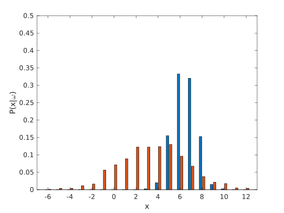

# Assignment #1

## 1. Machine Learning Problems
- (a)
    1. BF
    1. C
    1. AD
    1. BG
    1. AE
    1. AD
    1. BF
    1. AE
    1. BG
- (b)
    No. Data set should be divided into training set and test data. And we should not maximize the performance of the training set, but that of the test set.

## 2. Bayes Decision Rule
- (a)
    - (i)
        $$
        P(B_1=1)=\frac{1}{3}
        $$
    - (ii)
        $$
        P(B_2=0\mid B_1=1)=1
        $$
    - (iii)
        $$
        P(B_1=1\mid B_2=0)=\frac{P(B_2=0\mid B_1=1)+P(B_2=1\mid B_1=1)}{P(B_1=1)}=\frac{1}{2}
        $$
    - (iv)
        $$
        P(B_3=1\mid B_2=0)=P(B_1=1\mid B_2=0)=\frac{1}{2}
        $$
        So, after knowing B~2~ contains nothing, the probability of B~1~ and B~2~ containing the bonus is the same. So changing my choice or not are both okay.
- (b)
    - (i)
        The distribution of $P(x\mid \omega_i)$ is shown as follow:
        
        And the test error is 64.
    - (ii)
        The distribution of $P(\omega_i \mid x)$ is shown as follow:

        
        And the test error is 47.

    - (iii)
        The minimal total risk ($R=\sum_x\min_iR(\alpha_i \mid x)$) is $2.444354$.

## 3. Gaussian Discriminant Analysis and MLE
- (a)
    When $\Sigma_0=\Sigma_1=\Sigma=\begin{pmatrix} 1 & 0\\ 0 & 1 \end{pmatrix}=I, \phi=\frac{1}{2}, \mu_0=\left(0, 0\right), \mu_1=\left(1, 1\right)^T$. We have:
    $$
    P(\mathtt{x}\mid y=0)=\frac{1}{ 2\pi}e^{-\frac{1}{2}(x_1^2+x_2^2)}\\
    P(\mathtt{x}\mid y=1)=\frac{1}{2\pi}e^{-\frac{1}{2}(x_1-1)^2-\frac{1}{2}(x_2-1)^2}=\frac{1}{2\pi}e^{-\frac{1}{2}(x_1^2+x_2^2)}e^{x_1+x_2-1}\\
    $$
    So:
    $$
    \begin{align}
    P(y=1\mid \mathtt{x};\phi,\mu_0, \mu_1, \Sigma_0, \Sigma_1)&=
    \frac{P(\mathtt{x}\mid y=1)P(y=1)}{P(\mathtt{x}\mid y=0)P(y=0)+P(\mathtt{x}\mid y=1)P(y=1)}
    \\&=
    \frac{\frac{1}{4\pi}e^{-\frac{1}{2}(x_1^2+x_2^2)}e^{x_1+x_2-1}}{\frac{1}{4\pi}e^{-\frac{1}{2}(x_1^2+x_2^2)}+\frac{1}{4\pi}e^{-\frac{1}{2}(x_1^2+x_2^2)}e^{x_1+x_2-1}}\\
    &=\frac{e^{x_1+x_2-1}}{1+e^{x_1+x_2-1}}\\
    &=\frac{1}{1+e^{1-x_1-x_2}}
    \end{align}
    $$
    And at the same time, we get:
    $$
    \begin{align}
    P(y=0\mid \mathtt{x};\phi,\mu_0, \mu_1, \Sigma_0, \Sigma_1)&=
    1- P(y=1\mid \mathtt{x};\phi,\mu_0, \mu_1, \Sigma_0, \Sigma_1)
    \\&=\frac{1}{1+e^{x_1+x_2-1}}
    \end{align}
    $$
    Let $P(y=0)=P(y=1)$, we can get the solution of the discriminant plane:
    $$
    x_1+x_2=1
    $$
    When $x_1+x_2<1$, $P(y=0)>P(y=1)$, and when $x_1+x_2>1$, $P(y=0)<P(y=1)$. So the decision boundary is:
    $$
    \int_{x_1+x_2<1}{P(\mathtt{x}\mid y=0)P(y=0)}\,d\mathtt{x}+\int_{x_1+x_2>1}{P(\mathtt{x}\mid y=1)P(y=1)}\,d\mathtt{x}=0.76205
    $$
- (b)
    See the code.
- (c)
    The result plots are shown as follow:
    
    
- (d)
    I directly start from K-class gaussian model.
    Firstly divided the data set into K sub set.
    $$
    \mathtt{x}_k=\left\{ \mathtt{x}^{(i)} \mid y^{(i)}=k, i=1,\dots ,m\right\}\\
    N_k=\left|\mathtt{x}_k\right|
    $$
    Applying MLE, we have:
    $$
    \max{P\left(\mathtt{x}_k\mid \mathbf{\mu}_k, \mathbf{\Sigma}_k\right)}
    $$
    , where
    $$
    P\left(\mathtt{x}_k\mid \mathbf{\mu}_k, \mathbf{\Sigma}_k\right) = \prod_{\mathtt{x}\in \mathtt{x}_k}{\frac{1}{(2\pi)^{D/2}\left|\mathbf{\Sigma}_k\right|}\exp\left\{-\frac{1}{2}\left(\mathtt{x}-\mathbf{\mu}_k\right)^T\mathbf{\Sigma}_k^{-1}\left(\mathtt{x}-\mathbf{\mu}_k\right)\right\}}\\
    \ln P\left(\mathtt{x}_k\mid \mathbf{\mu}_k, \mathbf{\Sigma}_k\right) = -\frac{N_kD}{2}\ln{2\pi}-\frac{N_k}{2}\ln{\left|\mathbf{\Sigma}_k \right|}-\frac{1}{2}\sum_{\mathtt{x}\in \mathtt{x}_k}{\left(\mathtt{x}-\mathbf{\mu}_k\right)^T\mathbf{\Sigma}_k^{-1}\left(\mathtt{x}-\mathbf{\mu}_k\right)}
    $$
    Let
    $$
    \begin{align}
    &&\frac{\partial}{\partial \mathbf{\mu}_k}\ln{P\left(\mathtt{x}_k\mid \mathbf{\mu}_k, \mathbf{\Sigma}_k\right)}&=\sum_{\mathtt{x}\in \mathtt{x}_k}{\mathbf{\Sigma}_k^{-1}\left(\mathtt{x}-\mathbf{\mu}_k\right)}=\mathbf{0}\\
    \Rightarrow && \mathbf{\mu}_{ML_k}&=\frac{1}{\left|\mathtt{x}_k\right|}\sum_{\mathtt{x}\in \mathtt{x}_k}{\mathtt{x}}
    \end{align}
    $$
    The same for $\mathbf{\Sigma}_k$:
    $$
    \begin{align}
    &&&\frac{\partial}{\partial \mathbf{\Sigma}_k}\ln{P\left(\mathtt{x}_k\mid \mathbf{\mu}_k, \mathbf{\Sigma}_k\right)}\\
    &&=&
    -\frac{N_k}{2}\frac{\partial}{\partial \mathbf{\Sigma}_k}\ln{\left|\mathbf{\Sigma}_k \right|}-\frac{1}{2}\frac{\partial}{\partial \mathbf{\Sigma}_k}\sum_{\mathtt{x}\in \mathtt{x}_k}{\left(\mathtt{x}-\mathbf{\mu}_k\right)^T\mathbf{\Sigma}_k^{-1}\left(\mathtt{x}-\mathbf{\mu}_k\right)}
    \\&&=&
    -\frac{N_k}{2}\left(\mathbf{\Sigma}_k^{-1}\right)^T-\frac{1}{2}\left(\mathbf{\Sigma}_k^{-1}\right)^T\left(\sum_{\mathtt{x}\in \mathtt{x}_k}{\left(\mathtt{x}-\mathbf{\mu}_k\right)\left(\mathtt{x}-\mathbf{\mu}_k\right)^T}\right)\left(\mathbf{\Sigma}_k^{-1}\right)^T
    \\&&=&
    -\frac{N_k}{2}\mathbf{\Sigma}_k^{-1}-\frac{1}{2}\mathbf{\Sigma}_k^{-1}\left(\sum_{\mathtt{x}\in \mathtt{x}_k}{\left(\mathtt{x}-\mathbf{\mu}_k\right)\left(\mathtt{x}-\mathbf{\mu}_k\right)^T}\right)\mathbf{\Sigma}_k^{-1}
    =\mathbf{0}\\
    \Rightarrow &&&
    N_k\mathbf{\Sigma}_k^{-1}=\mathbf{\Sigma}_k^{-1}\left(\sum_{\mathtt{x}\in \mathtt{x}_k}{\left(\mathtt{x}-\mathbf{\mu}_k\right)\left(\mathtt{x}-\mathbf{\mu}_k\right)^T}\right)\mathbf{\Sigma}_k^{-1}
    \\\Rightarrow &&&
    \mathbf{\Sigma}_{ML_k}=\frac{1}{\left|\mathtt{x}_k\right|}\sum_{\mathtt{x}\in \mathtt{x}_k}{\left(\mathtt{x}-\mathbf{\mu}_{ML_k}\right)\left(\mathtt{x}-\mathbf{\mu}_{ML_k}\right)^T}
    \end{align}
    $$
    For unbiased estimation:
    $$
    \mathbb{E}\left(\mathbf{\mu}_{ML_k}\right) = \mathbb{E}\left(\frac{1}{N_k}\sum_{\mathtt{x}\in \mathtt{x}_k}{\mathtt{x}}\right) = \frac{1}{N_k}\sum_{\mathtt{x}\in \mathtt{x}_k}{\mathbb{E}\left(\mathtt{x}\right)}=\mathbb{\mu}_k\\
    \begin{align}
    \mathbb{E}\left(\mathbf{\Sigma}_{ML_k}\right) &= \mathbb{E}\left[\frac{1}{N_k}\sum_{\mathtt{x}\in \mathtt{x}_k}{\left(\mathbf{x}-\mathbf{\mu}_{ML_k}\right)\left(\mathbf{x}-\mathbf{\mu}_{ML_k}\right)^T}\right]
    \\&= \frac{1}{N_k}\sum_{\mathtt{x}\in \mathtt{x}_k}{\mathbb{E}\left[\left(\mathbf{x}-\mathbf{\mu}_{ML_k}\right)\left(\mathbf{x}-\mathbf{\mu}_{ML_k}\right)^T\right]}
    \\&= \frac{1}{N_k}\sum_{\mathtt{x}\in \mathtt{x}_k}{\mathbb{E}\left(\mathbf{x}\mathbf{x}^T-2\mathbf{\mu}_{ML_k}\mathbf{x}^T+\mathbf{\mu}_{ML_k}\mathbf{\mu}_{ML_k}^T\right)}
    \\&= \frac{1}{N_k}\sum_{\mathtt{x}\in \mathtt{x}_k}{\mathbb{E}\left(\mathbf{x}\mathbf{x}^T\right)-2\mathbb{E}\left(\frac{\mathbf{\mu}_{ML_k}}{N_k}\sum_{\mathtt{x}\in \mathtt{x}_k}{\mathtt{x}^T}\right)+\mathbb{E}\left(\mathbf{\mu}_{ML_k}\mathbf{\mu}_{ML_k}^T\right)}
    \\&= \frac{1}{N_k}\sum_{\mathtt{x}\in \mathtt{x}_k}{\mathbb{E}\left(\mathbf{x}\mathbf{x}^T\right)-2\mathbb{E}\left(\mathbf{\mu}_{ML_k}\mathbf{\mu}_{ML_k}^T\right)+\mathbb{E}\left(\mathbf{\mu}_{ML_k}\mathbf{\mu}_{ML_k}^T\right)}
    \\&= \frac{1}{N_k}\sum_{\mathtt{x}\in \mathtt{x}_k}{\left(\mathbf{\mu}_k\mathbf{\mu}_k^T+\mathbf{\Sigma}_{k}\right)-2\left(\mathbf{\mu}_k\mathbf{\mu}_k^T+\frac{\mathbf{\Sigma}_k}{N_k}\right)+\mathbf{\mu}_k\mathbf{\mu}_k^T + \frac{\mathbf{\Sigma}_k}{N_k}}
    \\&=\frac{N_k-1}{N_k}\mathbf{\Sigma}_{k}\\
    \end{align}
    $$
    So evidently:
    $$
    \left\{
    \begin{aligned}
    &\mathbf{\mu}_{k}=\frac{1}{\left|\mathtt{x}_k\right|}\sum_{\mathtt{x}\in \mathtt{x}_k}{\mathtt{x}}\\ 
    &\mathbf{\Sigma}_{k}=\frac{1}{\left|\mathtt{x}_k\right|-1}\sum_{\mathtt{x}\in \mathtt{x}_k}{\left(\mathtt{x}-\mathbf{\mu}_k\right)\left(\mathtt{x}-\mathbf{\mu}_k\right)^T}\\
    &\phi_k=\frac{\left|\mathtt{x}_k\right|}{\sum_{i=1}^K\left|\mathtt{x}_i\right|}
    \end{aligned}
    \right.
    $$

## 4. Text Classification with Naive Bayes
- (a)
    1. nbsp
    1. viagra
    1. pills
    1. cialis
    1. voip
    1. php
    1. meds
    1. computron
    1. sex
    1. ooking
- (b)
    98.57%
- (c)
    False. Consider the ratio of spam and ham email is 1:99. Then according to Bayes theorem:
    $$
    p(S)=0.01, p(H)=0.99\\
    \begin{align}
    p(S\mid P_s)=&\frac{p(P_s\mid S)p(S)}{p(P_s\mid S)p(S)+p(P_s\mid H)p(H)}\\
    =&\frac{0.99\times0.01}{0.99\times0.01+0.01\times0.99}=0.5
    \end{align}
    $$
    , where $P_s$ means predicted as spam, and $P_h$ means predicted as ham, $S$ means its a spam, and $H$ means its a ham.
    From the result, we know that if our model says an email is spam, the probability of that it's really a spam is only 0.5.
- (d)
    For my classifier, $tp=1093, fp=28, fn=31, tn = 2983$.
    So:
    $$
    precision = \frac{tp}{tp+fp}=97.5\%\\
    recall = \frac{tp}{tp+fn}=97.2\%
    $$
- (e)
    Recall is more important. Because we don't what to mis-predict a ham as spam. And it's acceptable to let go some spams.
    But for identifying drugs and bombs, the precision is more important because we cannot let go any drugs and bombs. 