# Assignment #3
## 1. Neural Networks
After finishing the code and training the three layer neural network, I got the loss 0.2347 and the test accuracy is 0.93200.
 
## 2. K-Nearest Neighbor
- a
    The decision boundaries are shown as follows:
    - K = 1
        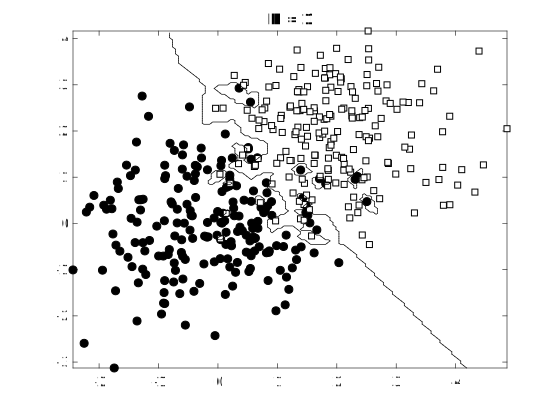
    - K = 2
        
    - K = 3
        
- b
    K should base on the number of classes and train data. If the number of train data is %N%, and the number of classes is $C$, the $K$ should be:
    $$
    K \leqslant \left\lfloor\frac{N}{C} \right\rfloor
    $$
    The closer $K$ is to the right side of the inequation, the more linear the decision boundary is.
- c
    I prepared 20 train data and 4 test data. And the result is pretty good:
    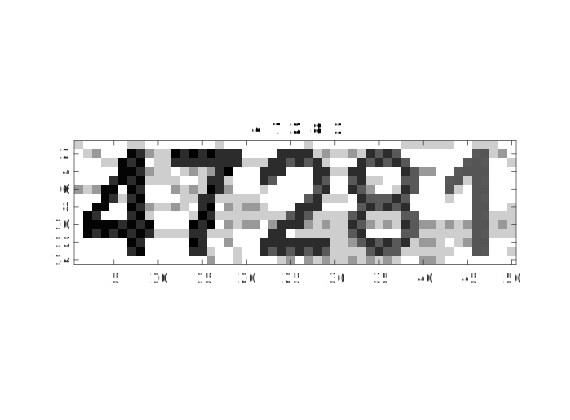
    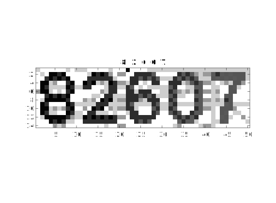
    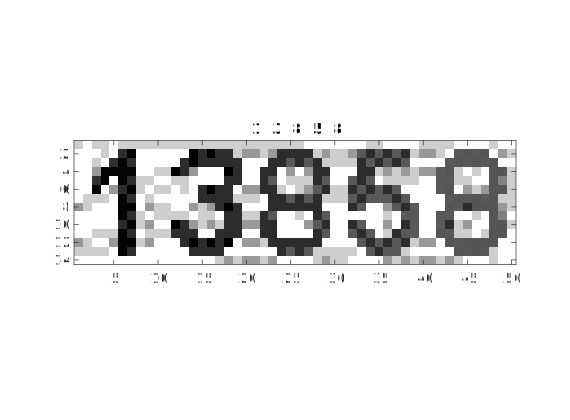
    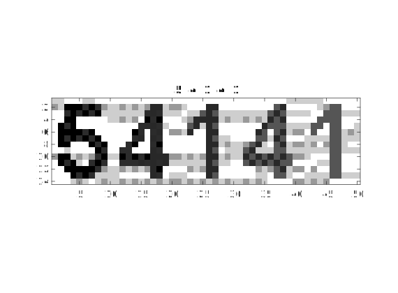
    The title is the predict digits and the image is the input. They are all right!

## 3. Decision Tree and ID3
The entropy is:
$$
Entropy(S) = - \sum_{i=1}^c{P_i\log{P_i}} = -\frac{200}{450}\log{\frac{200}{450}} - \frac{250}{450}\log\frac{250}{450} = 0.9910
$$
Then, the gains are:
$$
\begin{align}
Gain(S, GPA)& = & Entropy(S) & - \frac{215}{450}\left(-\frac{15}{215}\log\frac{15}{215}- \frac{200}{215}\log\frac{200}{215}\right) \\ &&& -  \frac{235}{450}\left(-\frac{185}{235}\log\frac{185}{235} - \frac{50}{235}\log\frac{50}{235}\right) 
\\
&=&0.4266&
\\
Gain(S, Gender) & = & Entropy(S) & - \frac{205}{450}\left(-\frac{105}{205}\log\frac{105}{205}- \frac{100}{205}\log\frac{100}{205}\right) \\ &&& - \frac{245}{450}\left(-\frac{95}{245}\log\frac{95}{245} - \frac{150}{245}\log\frac{150}{245}\right)
\\
&=& 0.0112&
\end{align}
$$

According to the gains, the decision tree that will be generate by ID3 should be:
```mermaid {align="center"}
graph TB;
GPA--Low-->Gender1[Gender]
GPA--High-->Gender2[Gender]
Gender1--F-->M1[-]
Gender1--M-->M2[-]
Gender2--F-->P1[+]
Gender2--M-->P2[+]
```

## 4. K-Means Clustering
- a
    The graph as follow shows the two trails with largest and smallest SD.
    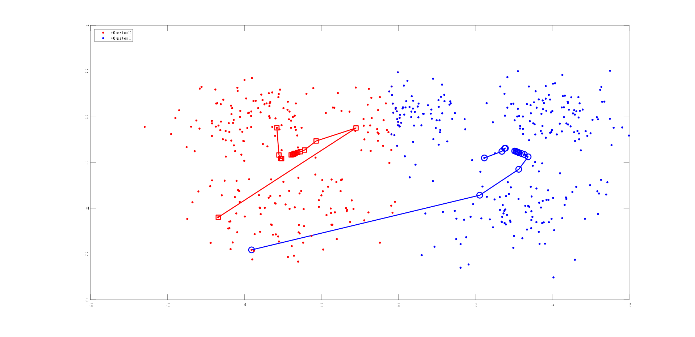
- b
    We can run k-means for serval times and the get average or maximum occurrence range as the result, we may get a more stable result.
- c
    The graph shown as follows are the result of k-means algorithm over `digit_data.mat`.
    - K = 10
        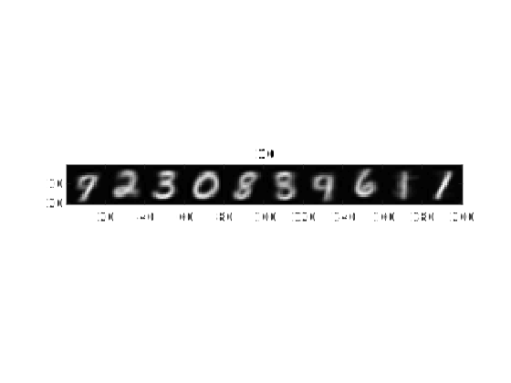
    - K = 20
        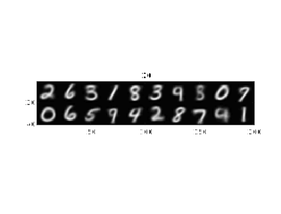
    - K = 50
        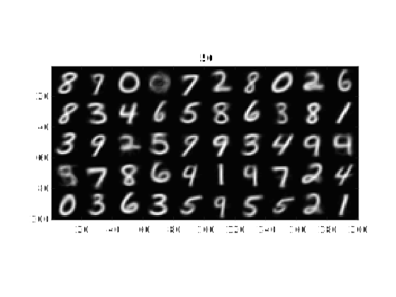
    k-means algorithm does discover patterns in dataset without any label information. But the result when K=10 is not good as expected. I think it's because of the representation of the dataset is not good enough for k-means.
- d
    The results of image compression using k-means are shown as follow:
    - K = 8
        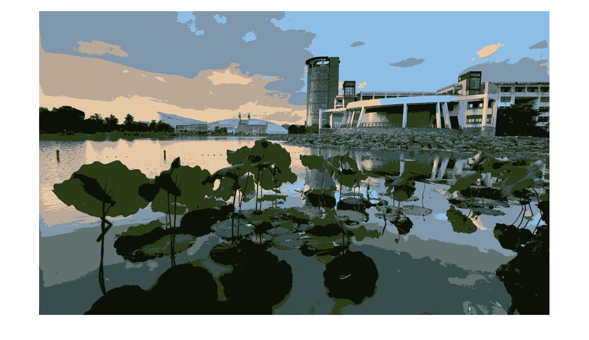
    - K = 16
        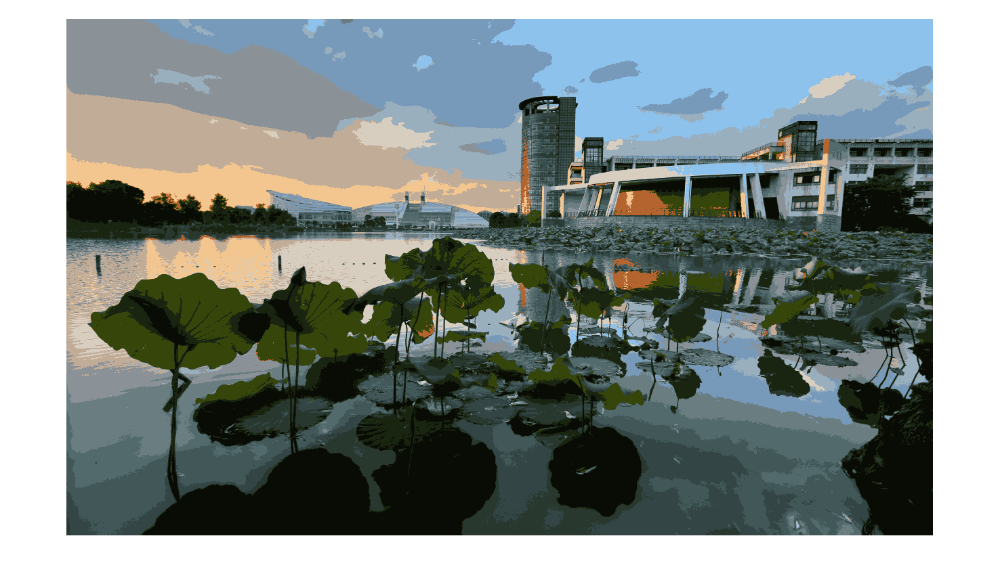
    - K = 32
        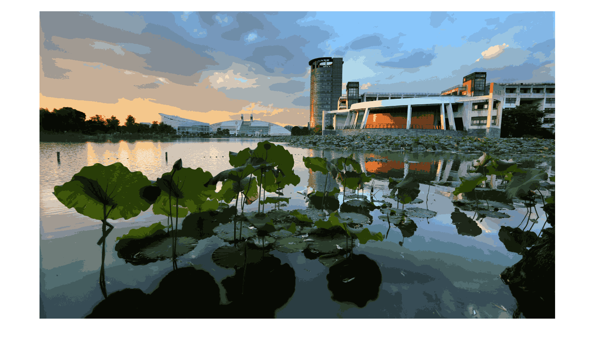
    - K = 64
        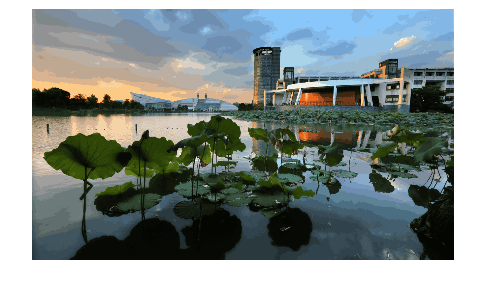
    - origin
        
    
    If K is set to 64, then the compress ratio can be calculate.
    Each pixel can be represent with $\log(K)$ bits. If the origin image has $N$ pixels and use 24 bits for each pixel, then the size of the origin image is:
    $$
    S_o = 24N
    $$
    When using k-means for compression, the size of the compressed image is:
    $$
    S_c = N\log(K)
    $$
    The compression ratio is:
    $$
    R = \frac{S_c}{S_o} = \frac{\log{K}}{24}
    $$
    When K is 64, the ratio is 25%.