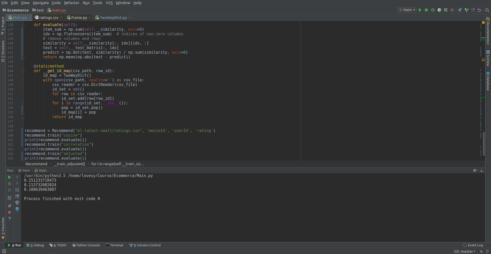

# 电子商务系统结构实验三选做题
## 实验要求
阅读论文全文，使用真实数据集按论文的步骤重复论文实验，实验结果与论文结果对比，在实验报告中给出截图并分析。
## 数据集
使用[http://grouplens.org/datasets/movielens/]()中的`ml-latest-small`数据集。总共有600多个用户和。用户评分在1-5之间，可有小数点。0代表没有评分。
选择这个数据集是因为这个数据集的大小较小，方便测试，并且数据比较新。
## 算法细节
本次选做题要求对比三种不同算法的准确度。
- Cosine算法
    这个算法是最简单的算法，物品的相似度使用两个物品的用户评分向量夹角余弦值。公式如下：
    $$
    sim(i,j)=cos(\vec{i},\vec{j})=\frac{\vec{i}\cdot\vec{j}}{\left\|\vec i\right\|_2\times\left\|\vec j\right\|_2}
    $$
    其中，$\vec i$和$\vec j$分别为第$i$个物品和第$j$个物品的用户评分向量。
- Correlation-based
    这个算法使用Pearson相关系数作为两个物品的相似度。Pearson相关系数是余弦相似度的一种改进，对向量进行去中心化，使得结果更加准确。其公式为：
    $$
    sim(i,j)=\frac{\sum_{u \in U}(R_{u,i}-\bar{R_i})(R_{u,j}-\bar{R_j})}{\sqrt{\sum_{u\in U}(R_{u,i}-\bar{R_i})^2}\sqrt{\sum_{u \in U}(R_{u,j}-\bar{R_j})^2}}
    $$
    其中集合$U$为经过过滤筛选的用户，一般为同时对这两个物品进行评分的用户集合。$R_{u,i}$为用户$u$对物品$i$的评分，$\bar {R_i}$为物品$i$的平均得分。
- Adjusted Cosine
    这个算法是对以上两个算法的改进。因为上面两个算法都只针对了物品，但是我们同时也应该考虑到每个用户的评分标准不一样，所以我们去中心化的时候，不采用物品的平均得分，而采用用户的平均给分，可以对算法进行改进。
    $$
    sim(i,j)=\frac{\sum_{u \in U}(R_{u,i}-\bar{R_u})(R_{u,j}-\bar{R_u})}{\sqrt{\sum_{u\in U}(R_{u,i}-\bar{R_u})^2}\sqrt{\sum_{u \in U}(R_{u,j}-\bar{R_u})^2}}
    $$
    这里集合$U$和$R_{u,i}$定义跟上一个算法一样，而$\bar{R_u}$则为用户$u$的平均打分。
- Predict
    有了物品之间的相似度，我们还要根据这个相似度针对某个用户对某个物品的评分进行预测。这里采用最简单的加权平均，即其他物品与该物品的相似度作为权，用户对其他物品的评分作为值进行加权平均：
    $$
    P_{u,i}=\frac{\sum_{{\rm all\ similar\ items,\ N}}{(s_{i,N}\times R_{u,N})}}{\sum_{{\rm all\ similar\ items,\ N}}{(\left|s_{i,N}\right|)}}
    $$
    这里$N$表示与改物体相似的其他物体集的一个元素，$s_{i,N}$为物体$i$与物体$N$的相似度，$R_{u,N}$为用户$u$对物体$i$的评分。
- MAE
对于算法准确度评估，我们使用$MAE$进行衡量。
    根据论文中的定义，$MAE$的定义如下：
    $$
    MAE=\frac{\sum^N_{i=1}{	\left|p_i-q_i \right|}}{N}
    $$
    其中$N$为测试数据大小，$p_i$为预测评分，$q_i$为实际评分。
## 代码实现
本次实现为了开发效率，采用了`python`进行开发，但是相对地运行效率不是很理想，使用小数据集也能运行一个多小时。
- 读取数据
    数据集为csv文件，可以使用`python`原生提供的csv读取库，但后来发现有更好的`pandas`库，所以实验中混用两种库。
    1. 统计数据集数据。
        数据集中的用户id是从1开始排序的，但是物品（电影）id并不是从1开始排序的，所以需要对物品id进行一个映射，同时也对用户id进行同样的映射。
        ```python
        @staticmethod
        def __get_id_map(csv_path, row_id):
            id_map = TwoWayDict()
            with open(csv_path, newline='') as csv_file:
                csv_reader = csv.DictReader(csv_file)
                id_set = set()
                for row in csv_reader:
                    id_set.add(row[row_id])
                for i in range(id_set.__len__()):
                    pop = id_set.pop()
                    id_map[i] = pop
        return id_map
        ```
        其中`TwoWayDict`为自己实现的字典，可以从键读取到值，也可以从值读取到键。实现比较简单，这里不详细解释这个类。
        在进行统计时候，先使用了`set`进行id保存，这里出于两个目的：可以筛选重复值，另外`set`中的hash比较随机，可以使得后面分离数据集和测试集时候有随机性。
    1. 建立用户-物品矩阵
        实验协同过滤算法的首要步骤就是建立一个用户-物品矩阵，然后才能从中获取向量代入算法中的公式计算。
        ```python
        def __build_matrix(self, csv_path, user_id_name, item_id_name, rating_id):
            csv_data = pd.read_csv(csv_path)
            self.__matrix = np.zeros([self.user_size(), self.item_size()])

            def __assign_matrix(row):
                user_id = str(int(row[user_id_name]))
                item_id = str(int(row[item_id_name]))
                user_index = self.__user_id.get_key(user_id)
                item_index = self.__item_id.get_key(item_id)
                self.__matrix[user_index, item_index] = row[rating_id]

            csv_data.apply(__assign_matrix, axis=1)
        ```
    1. 分离训练集和测试集
        这里采用了简单的分离方法，直接分离相应数量的列。因为建立矩阵时候使用了`set`，所以分离之后还是有一点随机性的。
        ```python
        self.__train_size = int(self.__matrix.shape[0] * ratio)
        self.__test_size = self.__matrix.shape[0] - self.__train_size
        self.__train_matrix = self.__matrix[:self.__train_size, :]
        self.__test_matrix = self.__matrix[self.__train_size:, :]
        ```
- 实现Cosine算法
    Cosine算法实现比较简单，直接取出两列然后算夹角余弦就可以了。这里迭代时候保证`j>i`，可以减少一半工作量，并且去除自相似的情况（即自己更自己的相似度为1）。
    ```python
    def __item_cosine(self, i, j):
        vector_i = self.__train_matrix[:, i]
        vector_j = self.__train_matrix[:, j]
        sq_len = np.sum(np.square(vector_i)) * np.sum(np.square(vector_j))
        if sq_len == 0:
            return 0
        return np.dot(vector_i, vector_j) / np.sqrt(sq_len)

    def __train_cosine(self):
        similarity = np.zeros([self.item_size(), self.item_size()])
        for i in range(self.item_size()):
            for j in range(i+1, self.item_size()):
                similarity[i, j] = similarity[j, i] = self.__item_cosine(i, j)
        self.__similarity = similarity
    ```
- 实现Correlation算法
    实现Correlation算法之前我们应该对用户进行筛选的。但是我们使用的数据集用户较少，而且为了运行时间考虑，这里不对用户进行筛选。
    训练前先算出每个物品的平均评分，然后再取出两个物品代入公式计算。
    ```python
    def __item_correlation(self, i, j, mean):
        vector_i = self.__train_matrix[:, i] - mean[i]
        vector_j = self.__train_matrix[:, j] - mean[j]
        sq_len = np.sum(np.square(vector_i)) * np.sum(np.square(vector_j))

        if sq_len == 0:
            return 0
        return np.dot(vector_i, vector_j) / np.sqrt(sq_len)

    def __train_correlation(self):
        similarity = np.zeros([self.item_size(), self.item_size()])
        mean = [0] * self.item_size()
        for i in range(self.item_size()):
            item = self.__train_matrix[:, i]
            count = item[item > 0].shape[0]
            if count > 0:
                mean[i] = np.sum(item) / count
            else:
                mean[i] = 0
        for i in range(self.item_size()):
            for j in range(i+1, self.item_size()):
                similarity[i, j] = similarity[j, i] = self.__item_correlation(i, j, mean)
        self.__similarity = similarity
    ```
- 实现Adjust算法
    跟Correlation算法实现相似，略去筛选用户步骤。先对用户平均评分进行计算，然后得出用户平均评分向量，在计算前对物品评分向量减去用户平均评分向量即可。
    ```python
    def __item_adjusted(self, i, j, mean):
        vector_i = self.__train_matrix[:, i] - mean
        vector_j = self.__train_matrix[:, j] - mean
        sq_len = np.sum(np.square(vector_i)) * np.sum(np.square(vector_j))
        if sq_len == 0:
            return 0
        return np.dot(vector_i, vector_j) / np.sqrt(sq_len)

    def __train_adjusted(self):
        similarity = np.zeros([self.item_size(), self.item_size()])
        mean = np.array([0] * self.__train_size, dtype=float)
        for i in range(self.__train_size):
            user = self.__train_matrix[i, :]
            count = user[user > 0].shape[0]
            if count > 0:
                mean[i] = np.sum(user) / count
            else:
                mean[i] = 0
        for i in range(self.item_size()):
            for j in range(i+1, self.item_size()):
                similarity[i, j] = similarity[j, i] = self.__item_adjusted(i, j, mean)
        self.__similarity = similarity
    ```
    以上几个算法都需要考虑零向量的问题。算出零向量的时候，可以断言已知用户集中，这两个物品的评分用户几乎没有交际，所以相似度可视为0。
- 预测与评估
    预测和评估也很简单，对于测试集的每一行（每一个用户），用用户评分向量乘以相似度再求和（点积），即可得到每个用户已经评分的物品的预测值（这里计算时不需要考虑这个物品本身的对自己预测评分的影响，因为自己跟自己的相似度我们设定为0了），然后除以相似度之和即可。
    ```python
    def evaluate(self):
        item_sum = np.sum(self.__similarity, axis=0)
        idx = np.flatnonzero(item_sum)  # indices of non-zero columns
        # remove columns and rows
        similarity = self.__similarity[:, idx][idx, :]
        test = self.__test_matrix[:, idx]
        predict = np.dot(test, similarity) / np.sum(similarity, axis=0)
        return np.mean(np.abs(test - predict))
    ```
    最后用实例向量与测试向量相见、求绝对值平均，就得到$MAE$了。
    *更多代码细节可以查看源代码。*
## 测试结果
下图为测试结果的截图。

从上到下分别为Cosine、Correlation和Adjust算法的运行结果（$MAE$）了。
根据这个结果我们可以画出柱状图：
```vega-lite {align="center"}
{
  "data": {
      "values":[
        {"Algorithm": "Adjusted cosine", "MAE": 0.108639463807},
        {"Algorithm": "Pure cosine", "MAE": 0.151233718473 },
        {"Algorithm": "Correlation", "MAE": 0.113732082024 }
      ]
  },
  "mark": "bar",
  "encoding": {
    "x": {
      "field": "Algorithm",
      "type": "ordinal"
    },
    "y": {
      "field": "MAE",
      "type": "quantitative"
    }
  },
  "width": 500,
  "height": 400
}
```
与论文中的结果
```vega-lite {align="center"}
{
  "data": {
      "values":[
        {"Algorithm": "Adjusted cosine", "MAE": 0.725},
        {"Algorithm": "Pure cosine", "MAE": 0.835 },
        {"Algorithm": "Correlation", "MAE": 0.83 }
      ]
  },
  "mark": "bar",
  "encoding": {
    "x": {
      "field": "Algorithm",
      "type": "ordinal",
      "scale": {
          "sort": false
      }
    },
    "y": {
      "field": "MAE",
      "type": "quantitative"
    }
  },
  "width": 500,
  "height": 400
}
```
趋势一致。可以认为论文中的结果正确并且可以复现，而且可能是由于数据集或者没有进行用户过滤的原因，我们的$MAE$比论文中的要好很多。
## 引用
[1. Badrul Sarwar, George Karypis, Joseph Konstan,John Riedl. *Item-Based Collaborative Filtering Recommendation Algorithms*](https://dl.acm.org/citation.cfm?id=372071)